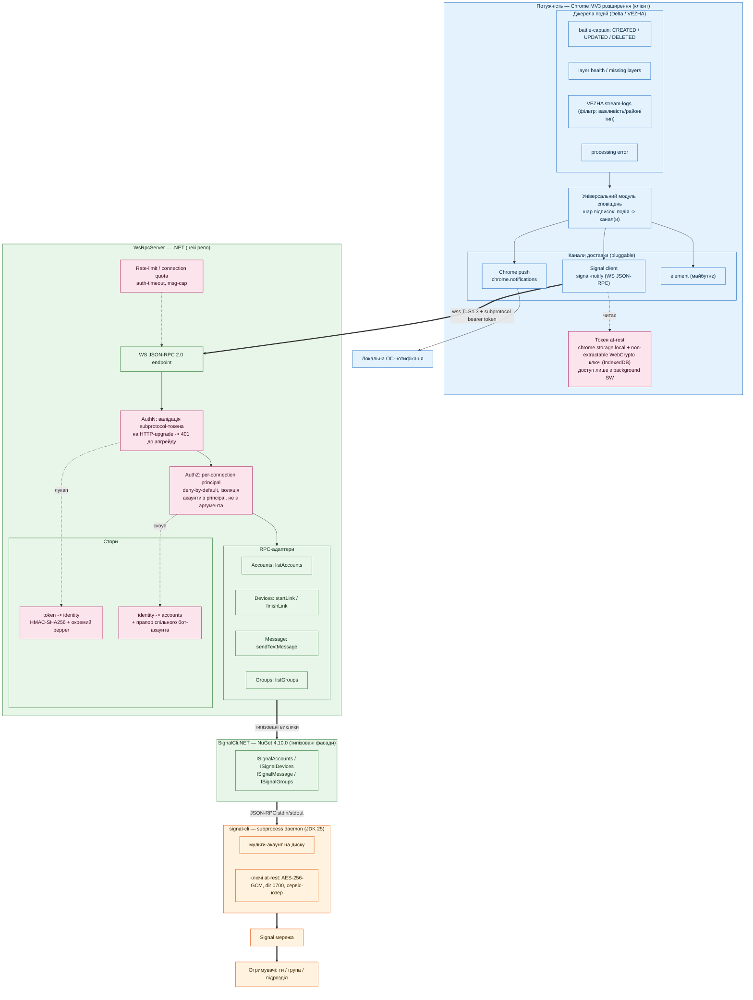

# Архітектура: універсальний модуль сповіщень + Signal-бекенд

Потік: подія в Потужності → шар підписок → канал(и) доставки. Канал Chrome push — локальний. Канал Signal — через WsRpcServer (цей репо) → SignalCli.NET → signal-cli → Signal.

Кольори: 🔵 клієнт (розширення) · 🟢 сервер (.NET) · 🟠 зовнішнє (signal-cli/мережа) · 🔴 безпекові вузли.

Рендер: [architecture.svg](architecture.svg)
