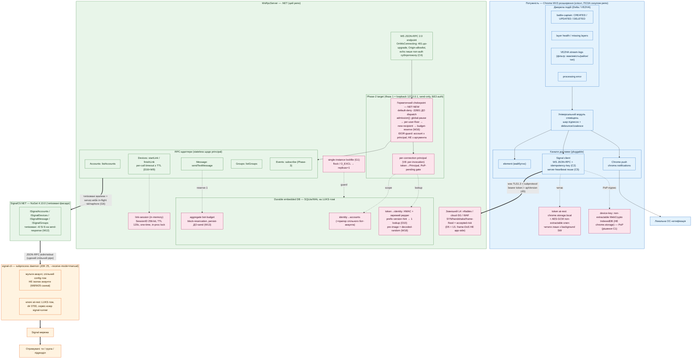

# Архітектура: універсальний модуль сповіщень + Signal-бекенд

Потік: подія в Потужності → шар підписок → канал(и) доставки. Канал Chrome push — локальний. Канал Signal — через WsRpcServer (цей репо) → SignalCli.NET → signal-cli → Signal.

> **Як читати схему (важливо — закриває N1/N2 зі звірки плану):**
> Діаграма показує **цільовий** стан після Фази 2. Зеленим — як-збудовано-сьогодні (Фаза 1: send-only, bind `127.0.0.1`, **БЕЗ auth**, тестів 0). Підграф **«Phase-2 target»** + усі 🔴 безпекові вузли (chokepoint, principal, token/identity/budget-стори, link-session, lockfile, L4) — **ще не існують у коді**, це NET-NEW робота Фази 2 (див. `PLAN-notifications-backend.md`). Events-адаптер (`AEV`) існує в коді, але **не зареєстрований** і активується лише в Фазі 3 (receive-шлях).

Кольори: 🔵 клієнт (розширення, поза скоупом цих репо) · 🟢 сервер (.NET, цей репо) · 🟠 зовнішнє (signal-cli/мережа) · 🔴 безпекові вузли (здебільшого Phase-2 target).

Рендер: [architecture.svg](architecture.svg) · [architecture.png](architecture.png)

## Що змінилося vs as-built

| Шар | Фаза 1 (як-збудовано) | Фаза 2 (target на схемі) |
|---|---|---|
| Bind | `127.0.0.1`, без TLS | `0.0.0.0` `wss://` TLS 1.3 + HSTS, за зовнішнім L4 |
| AuthN/AuthZ | **немає** | subprotocol-token + PoP + герметичний default-deny chokepoint |
| Ізоляція | н/д (один користувач) | per-connection principal (per-invocation, V8), IDOR-guard |
| Стори | немає | durable SQLite/WAL на LUKS: token (pepper-version-hint, D10), identity→accounts, aggregate-budget (block-reservation, W13); link-session in-memory |
| Rate-limit | глобальний `MaxConcurrentConnections` (вимкнено) | єдина admission-функція (W16) + reservation-budget + per-user floor |
| Адаптери | Accounts/Devices/Message **зареєстровані**; Groups — DI-рядок бракує (task-1); Events — існує, не зареєстрований | + Groups; Events лише Phase-3 (receive) |
| Single-instance | не гейтиться | lockfile `flock`/`O_EXCL` → `replicas=1` (G1) |

frame-accumulation DoS (assembly-abort / max-frame-count / slowloris) — **не app-side і не фікситься bump'ом JSON-RPC.NET** (gap у NetCoreServer нижче `OnWsReceived`); винесено в accepted-risk + зовнішній L4 (D5 + U1).
